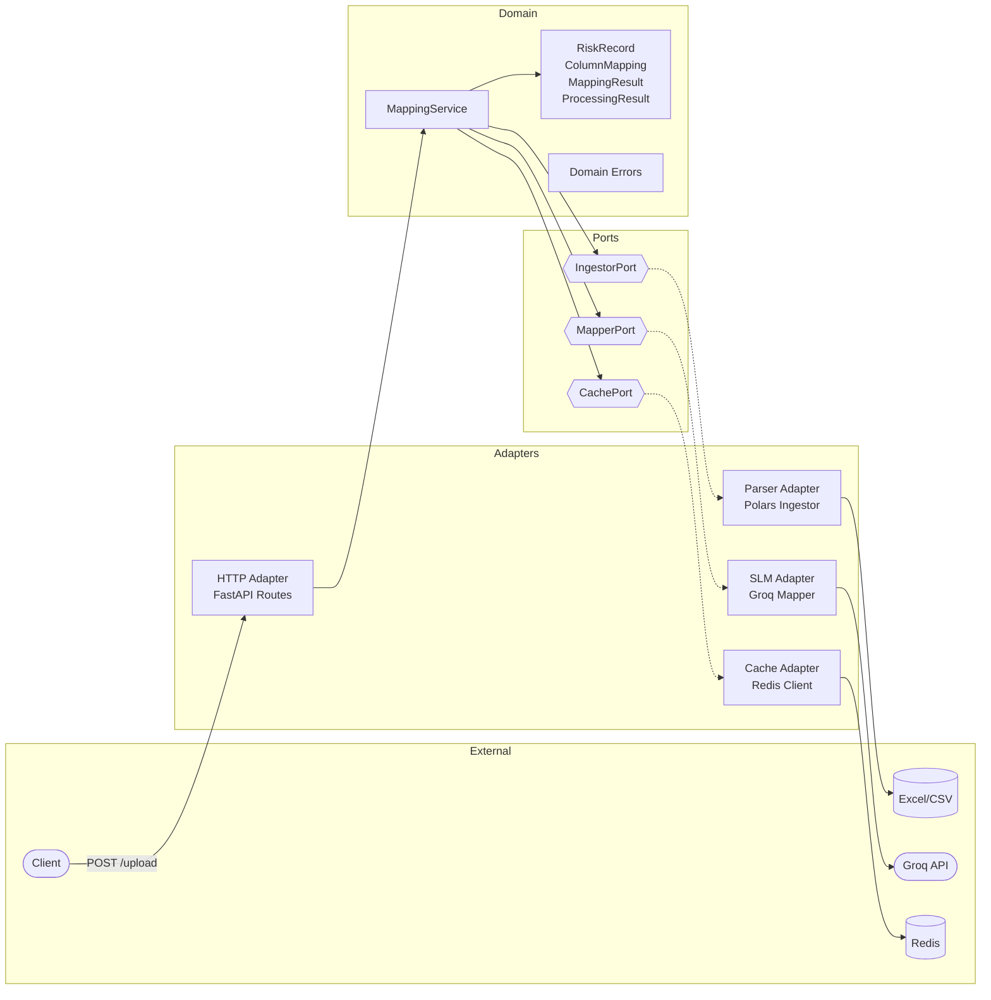

# RiskFlow

Automates the mapping of messy reinsurance spreadsheets (Bordereaux) to a standardized schema using Small Language Models (Groq/Llama 3.1).

## Prerequisites

- Python 3.12+
- [uv](https://docs.astral.sh/uv/)
- Docker & Docker Compose (for Redis)

## Getting Started

```bash
# Install dependencies
uv sync

# Copy environment template and add your Groq API key
cp .env.example .env

# Start Redis
docker compose up -d redis

# Run the API
uv run uvicorn src.entrypoint.main:app --reload --port 8000
```

## Development

```bash
# Run tests
uv run pytest -x -v tests/unit/

# Type checking
uv run mypy src/

# Lint and format
uv run ruff check src/
uv run ruff format src/
```

## TDD Cycle

1. **Red** — Write a failing test in `tests/unit/`
2. **Green** — Implement the minimum code in `src/domain/` or `src/adapters/` to make it pass
3. **Check** — Run `uv run mypy src/` and `uv run ruff check src/`
4. **Commit** — If all pass, commit with a descriptive message

Claude Code hooks enforce this — they block any commit where mypy, pytest, ruff check, or ruff format fail. GitHub Actions CI provides the same checks on PRs and pushes to main.

## Architecture

Hexagonal (Ports & Adapters). Dependencies only point inward.



**Data flow:** Upload → Parse headers → Check cache → (miss?) SLM maps headers → Validate rows → Return results

```
src/
  entrypoint/        # FastAPI wiring (composition root)
  domain/            # Business logic, models, validation
  ports/             # Interfaces (Protocol-based)
  adapters/          # Implementations (HTTP, Groq, Redis, Polars)
```

## Target Schema

All Bordereaux data is mapped to:

| Field | Format |
|-------|--------|
| `Policy_ID` | String |
| `Inception_Date` | ISO 8601 (YYYY-MM-DD) |
| `Expiry_Date` | ISO 8601 (YYYY-MM-DD) |
| `Sum_Insured` | Non-negative float |
| `Gross_Premium` | Non-negative float |
| `Currency` | ISO 4217 (USD, GBP, EUR, JPY) |
