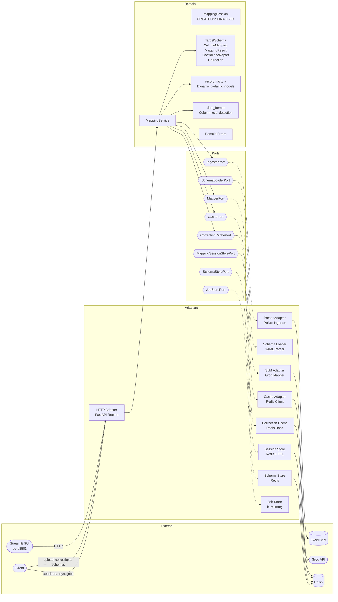

# RiskFlow

Automates the mapping of messy reinsurance spreadsheets (Bordereaux) to a standardized schema using Small Language Models (Groq/Llama 3.3).

## Documentation

- [Getting started tutorial](docs/tutorials/first-upload.md) — upload your first file in 5 minutes
- [Features overview](docs/explanation/features.md) — what RiskFlow delivers, with acceptance test checklist
- [API reference](docs/reference/api.md) — all endpoints, parameters, errors
- [Full documentation index](docs/index.md) — tutorials, how-to guides, explanations, reference

## Prerequisites

- Python 3.12+
- [uv](https://docs.astral.sh/uv/)
- Docker & Docker Compose (for Redis)
- A [Groq](https://console.groq.com) account and API key (free tier available)

## Getting Started

### One command (Docker — recommended)

```bash
# Copy environment template and add your Groq API key
cp .env.example .env
# Edit .env and set GROQ_API_KEY=gsk_your_key_here

# Start everything: API + Redis + GUI
docker compose up -d
```

Open http://localhost:8501 for the GUI, or http://localhost:8000/docs for the API.

### Local development (without Docker)

```bash
# Install dependencies
uv sync

# Copy environment template and add your Groq API key
cp .env.example .env

# Start Redis (still needs Docker)
docker compose up -d redis

# Run the API
uv run uvicorn src.entrypoint.main:app --reload --port 8000

# Run the GUI (in a separate terminal)
uv run streamlit run gui/app.py
```

## Development

```bash
# Run tests
uv run pytest -x -v tests/unit/

# Type checking
uv run mypy src/

# Lint and format
uv run ruff check src/
uv run ruff format src/
```

## TDD Cycle

1. **Red** — Write a failing test in `tests/unit/`
2. **Green** — Implement the minimum code in `src/domain/` or `src/adapters/` to make it pass
3. **Check** — Run `uv run mypy src/` and `uv run ruff check src/`
4. **Commit** — If all pass, commit with a descriptive message

Claude Code hooks enforce this — they block any commit where mypy, pytest, ruff check, or ruff format fail. GitHub Actions CI provides the same checks on PRs and pushes to main.

## Architecture

Hexagonal (Ports & Adapters). Dependencies only point inward.



**Data flows:**
- **Batch:** Upload → Parse headers → Check cache → (miss?) Check corrections → SLM maps uncorrected headers → Merge → Validate rows → Return results with confidence report
- **Interactive:** Upload → SLM suggests → User edits mappings → Finalise → Validate rows → Return results

**Endpoints:**

| Endpoint | Method | Description |
|----------|--------|-------------|
| `/upload` | POST | Synchronous upload with optional `?sheet_name`, `?cedent_id`, `?schema` |
| `/upload/async` | POST | Async upload, returns job ID for polling |
| `/jobs/{id}` | GET | Poll async job status and result |
| `/sheets` | POST | List sheet names in an Excel file |
| `/corrections` | POST | Submit human-verified mapping corrections |
| `/schemas` | GET | List available target schemas |
| `/schemas/{name}` | GET | View a schema's full definition |
| `/schemas` | POST | Create a runtime schema from JSON |
| `/schemas/{name}` | DELETE | Delete a runtime schema |
| `/sessions` | POST | Upload file, get SLM suggestion + preview (interactive) |
| `/sessions/{id}` | GET | Current session state |
| `/sessions/{id}/mappings` | PUT | Edit mappings before finalising |
| `/sessions/{id}/finalise` | POST | Validate rows with user's mapping |
| `/sessions/{id}` | DELETE | Cleanup session + temp file |
| `/health` | GET | Health check |

```
src/
  entrypoint/        # FastAPI wiring (composition root)
  domain/
    model/           # TargetSchema, MappingSession, ColumnMapping, date_format, errors
    service/         # MappingService (orchestration)
  ports/
    input/           # IngestorPort
    output/          # MapperPort, CachePort, SessionStorePort, SchemaStorePort, ...
  adapters/
    http/            # FastAPI routes
    slm/             # Groq API mapper
    storage/         # Redis cache, session store, schema store, job store
    parsers/         # Polars ingestor, YAML schema loader
```

## Target Schema

The default target schema (`schemas/standard_reinsurance.yaml`) maps Bordereaux data to:

| Field | Type | Constraints |
|-------|------|------------|
| `Policy_ID` | String | Not empty |
| `Inception_Date` | Date | Required |
| `Expiry_Date` | Date | Must not precede Inception_Date |
| `Sum_Insured` | Float | Non-negative |
| `Gross_Premium` | Float | Non-negative |
| `Currency` | Currency | USD, GBP, EUR, JPY |

The schema is configurable via YAML. Custom schemas can define different fields, types, constraints, cross-field rules, and SLM hints. See:
- [Schema reference](docs/reference/schema.md) — field types, constraints, YAML format
- [How to use a custom schema](docs/how-to/custom-schema.md) — step-by-step guide
